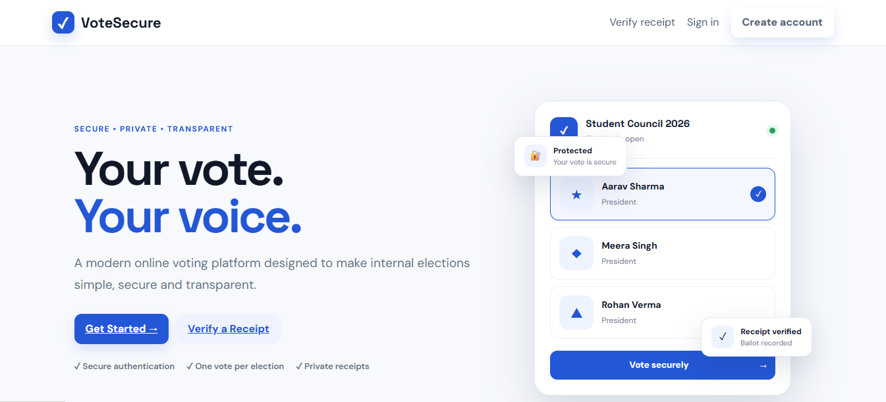
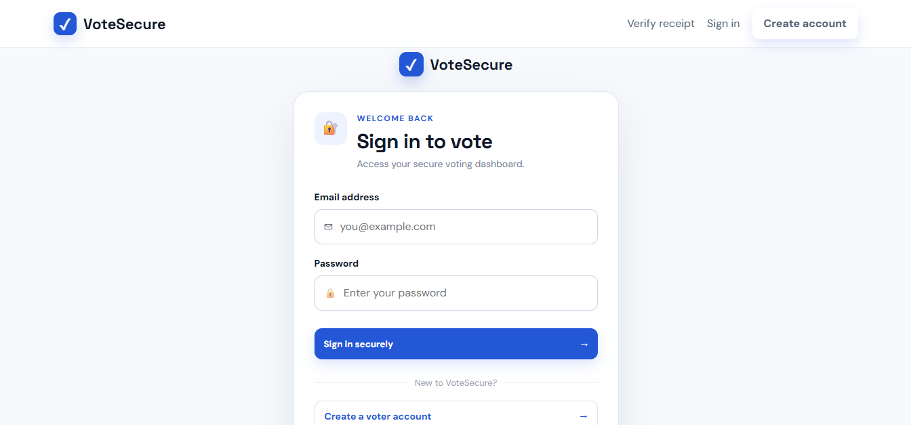
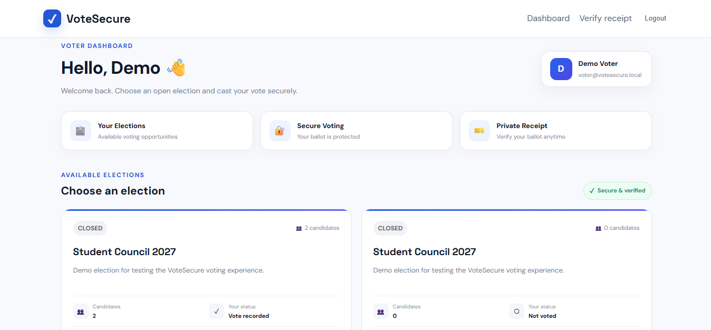
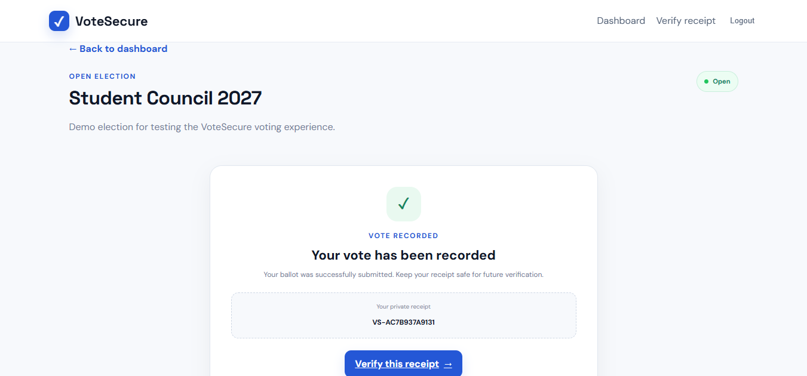
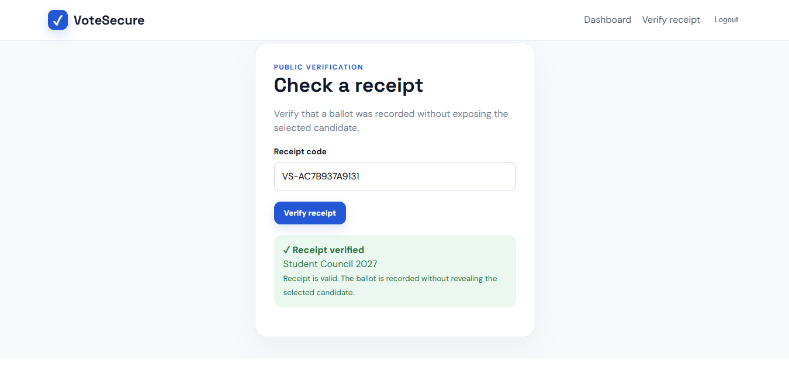
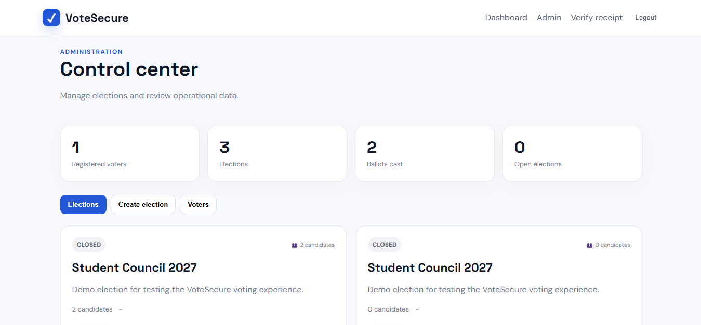

# VoteSecure — Full-Stack Online E-Voting System

VoteSecure is a portfolio-ready full-stack e-voting web application designed for **clubs, student councils, co-ops, and internal organizational polls**.

It demonstrates a secure voting workflow with authentication, administrator 2FA, protected ballots, receipt verification, audit tracking, and post-election results.

> **Important:** VoteSecure is an educational/portfolio project and is **not intended for public or government elections**.

---

## 🚀 Live Demo

Coming soon.

---

## 📸 Screenshots

### Landing Page



### Login



### Voter Dashboard



### Vote Receipt



### Receipt Verification



### Admin Dashboard



### Election Results


---

## ✨ Features

### Voter Features

- User registration and login
- Voter dashboard
- View available elections
- Candidate selection
- Password confirmation before voting
- One-vote-per-election enforcement
- Secure vote submission
- Unique vote receipt
- Receipt verification
- Election status tracking

### Admin Features

- Secure administrator login
- Authenticator-app TOTP 2FA
- Admin dashboard
- Create and manage elections
- Add election candidates
- Open and close elections
- View registered voters
- View election results after closure
- Election and ballot statistics

### Security Features

- Password hashing with bcrypt
- Session-based authentication
- CSRF protection
- Rate limiting
- Helmet security headers
- Protected admin routes
- Database transactions for vote enforcement
- Append-only ballot hash chain
- Receipt verification without exposing the voter's candidate choice
- Results restricted until election closure

---

## 🛠️ Tech Stack

### Frontend

- HTML5
- CSS3
- Vanilla JavaScript

### Backend

- Node.js
- Express.js

### Database

- SQLite
- better-sqlite3

### Security

- bcrypt
- Express Sessions
- TOTP / Authenticator App
- Helmet
- Express Rate Limit
- CSRF protection

---

## 🔄 Main Voting Flow

```text
Register / Login
       ↓
Voter Dashboard
       ↓
Select Election
       ↓
Choose Candidate
       ↓
Confirm Password
       ↓
Cast Vote
       ↓
Generate Receipt
       ↓
Verify Receipt
       ↓
Admin Closes Election
       ↓
View Results